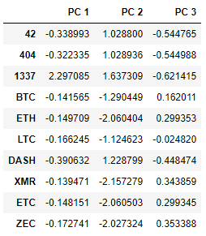

# Cryptocurrencies - Module 19 Challenge
UNC Chapel Hill Data Analytics Bootcamp

## Overview of Project
For Module 19, Jupyter Notebook was used with Pandas and Scikit-learn to perform predictive analysis on cryptocurrency data. The original CSV file, retrieved from [CryptoCompare](https://min-api.cryptocompare.com/data/all/coinlist), was preprocessed, clustered, and visualized with unsupervised machine learning to create a classification system for cryptocurrencies.

## Method & Results
### Preprocessing the Data for PCA
After loading the dataset into a dataframe, only cryptocurrencies being traded and where coins have been mined were kept. Any rows with null values were dropped. Since the clustering algorithm does not need the coin names, that column was moved to a separate dataframe. Using `get_dummies()`, variables were created for `Algorithm` and `ProofType`, stored in the `X` dataframe, and standardized.

  
Crypto dataframe

  
  
  

  
X dataframe

  
  
  

### Reducing Data Dimensions Using PCA
The Principal Component Analysis (PCA) algorithm was applied and transformed using the values in `X`, using three principal components. The results were used to create a `pcs_df`, with each cryptocurrency coin name having three PC values.

  
PCs dataframe

  
  
  

### Clustering Cryptocurrencies Using K-means
Using hvPlot, the best value for k was first found with an elbow curve, before running K-Means with `k=4` and fitting and predicting with the model with the `pcs_df`.

  
Elbow curve

  
  
  

A new dataframe, `clustered_df`, was created, merging the `crypto_df` and `pcs_df`. Two columns, `CoinName` and `Class`, were added and filled with values from `coin_name_df` and the previously-created `predictions`, respectively.

  
Clustered dataframe

  
  
  

### Visualizing Cryptocurrency Results
Using the `crypto_df` made above, an interactive 3D scatterplot was generated, with the coin name, each PC value, algorithm, and class showing on hover.

  
3D scatter preview

  
  
  Go to the `crypto_clustering.ipynb` file to interact with the graphic.
  

The dataframe was then used to create an hvPlot table with all 532 tradable cryptocurrencies.

  
Clustered dataframe hvplot table

  
  
  

The data was scaled to be contained between zero and one, and a new dataframe, `plot_df`, was made with it. The new dataframe was used to create an hvPlot scatterplot to show the relationship between total coin supply and total coins mined for the different cryptocurrencies.

  
Plot dataframe

  
  
  

  
hvPlot scatterplot

  
  
  

